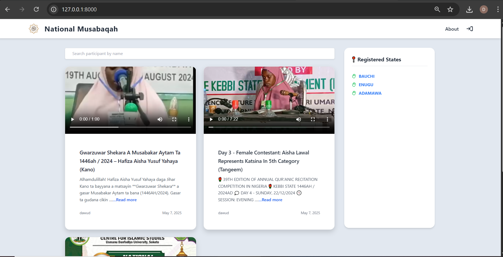
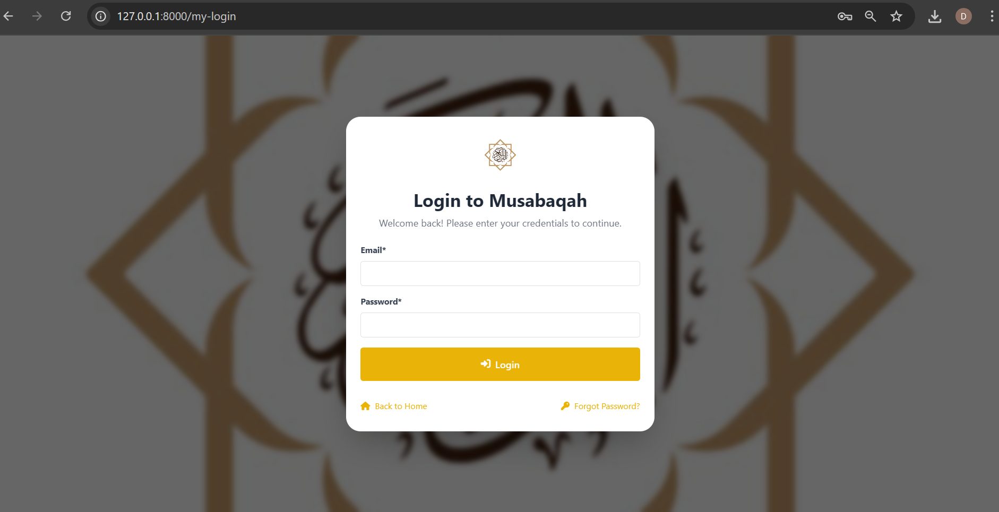
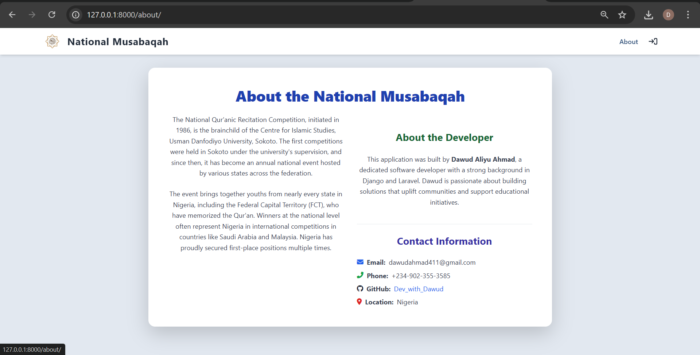
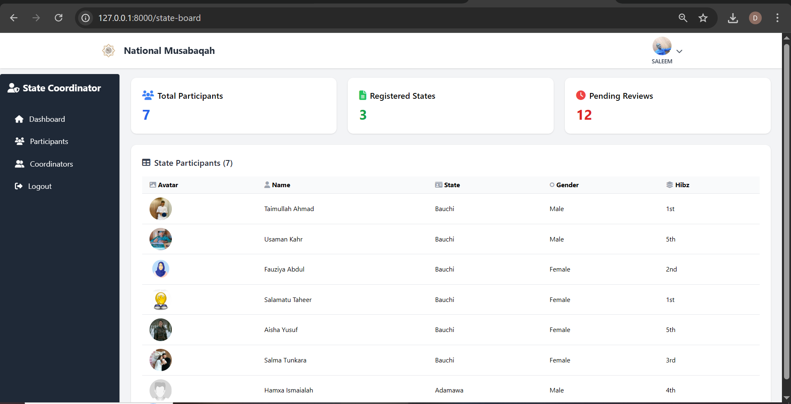
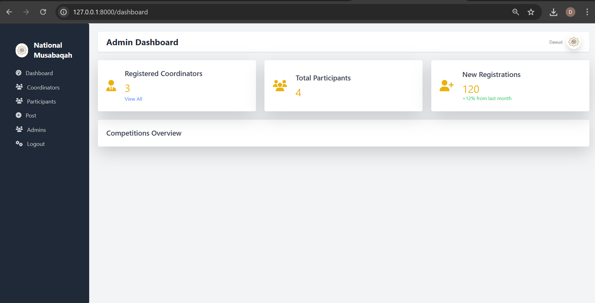
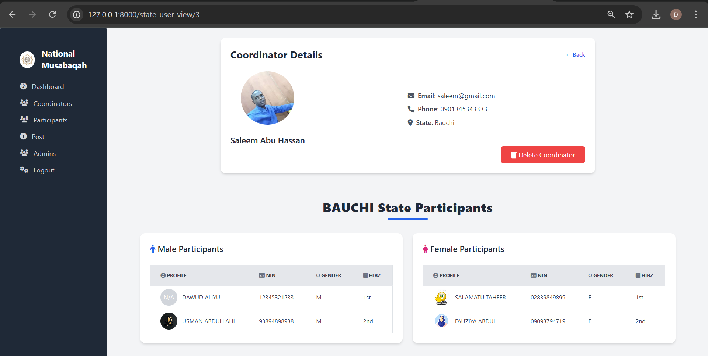

# 🇳🇬 National Musabaqah - Qur’anic Competition System

A web-based platform developed to simplify and modernize the registration and management process of the Nigerian National Qur’anic Competition.

---

## 📌 Overview

This system is designed to move the Musabaqah registration from manual, paper-based processes to an efficient digital platform. It saves time, eliminates paperwork, and promotes transparency across all states.

---

## 👥 User Roles & Permissions

### 1. 🧑‍💻 Public Users
- View general information about the competition.
- Browse coordinators by state.
- View participants representing each state.
- Search participants by name.

### 2. 🧑‍🏫 State Coordinators
- Register participants representing their state.
- Edit or delete participant data.
- View participants registered by coordinators from other states.

### 3. 🛡️ Community Board (Super Admin)
- Register and manage coordinators.
- Post updates and announcements to the public.
- View participants across all states.
- Control and moderate system-wide access.

---

## 🌐 Tech Stack

- **Backend**: Django (Python)
- **Frontend**: Tailwind CSS
- **Database**: SQLite / PostgreSQL
- **Version Control**: Git & GitHub

---

## 🚀 Key Features

- 📥 Digital registration for participants
- 🔍 Search functionality for participants by name
- 📊 Coordinator dashboard for participant management
- 📢 Public announcements from the admin
- 🔐 Role-based access and control

---

## 🎯 Project Goal

To provide a fast, paperless, and accessible digital system that supports the national Musabaqah competition's workflow and data handling for coordinators and administrators.

---

## 🛠️ How to Run Locally

```bash
# Clone the repository
git clone https://github.com/codeWithDrammzy/nation-musabaqah.git
cd nation-musabaqah

# Set up the environment
pip install -r requirements.txt

# Run migrations
python manage.py migrate

# Create a superuser
python manage.py createsuperuser

# Start the server
python manage.py runserver


## 📸 Screenshots

### 🏠 Homepage


### 🏠 Login


### 🏠 Aboutpage


### 📋 Coordinator Dashboard


### 📋 Coordinator Participants form


### 📋 Admin dashboard



### 📋 Admin



### 📋 Admin

